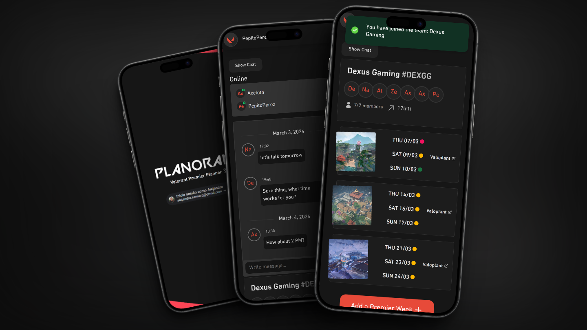
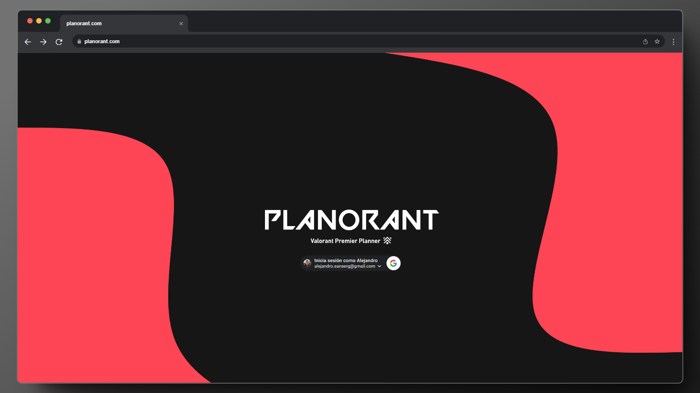
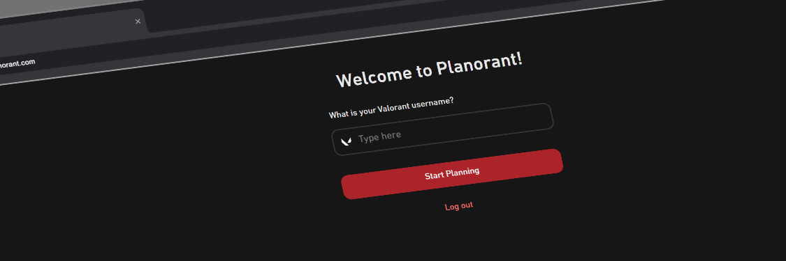
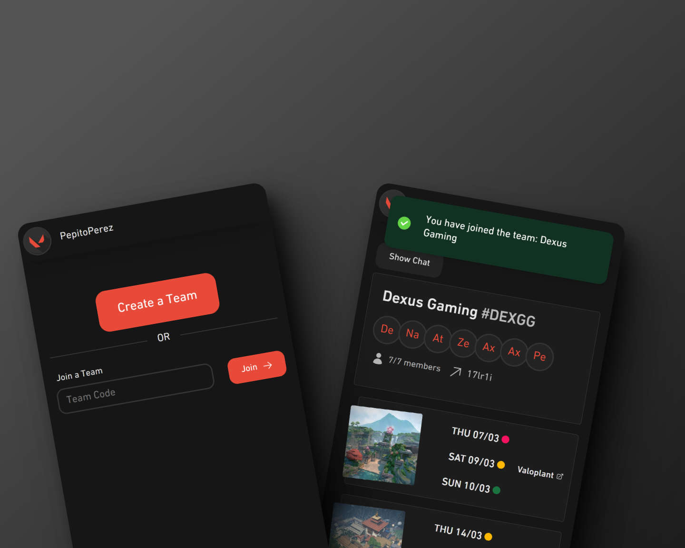
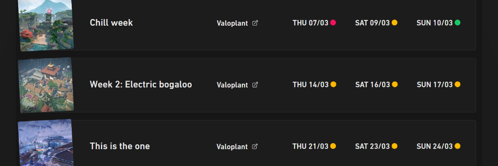
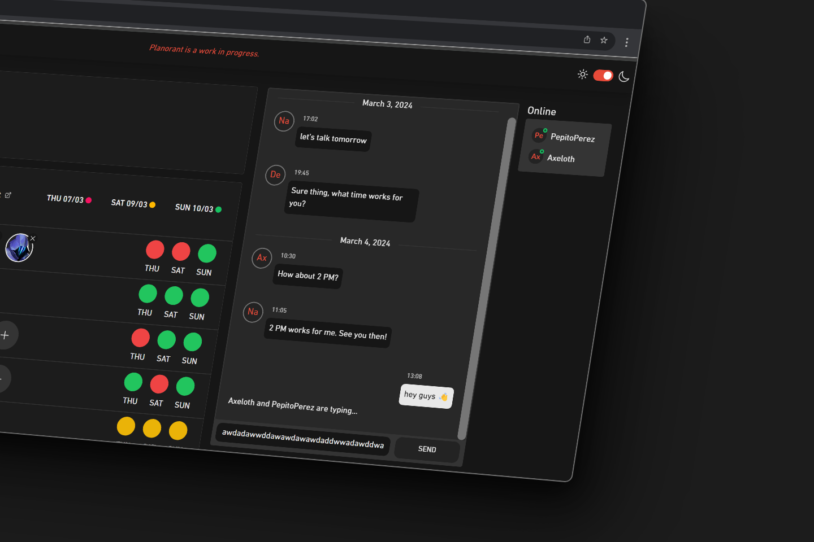
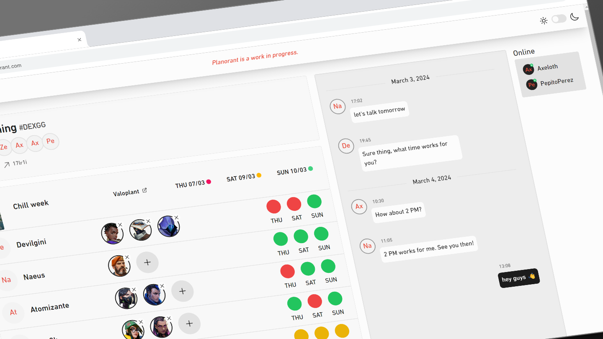
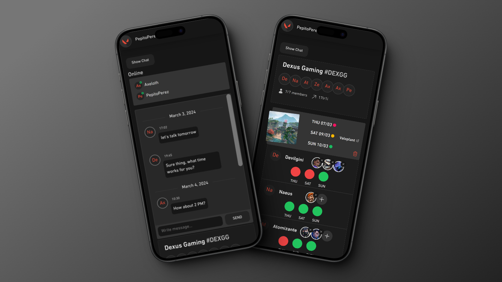

<div align="center">
  <br />
    <a href="https://planorant.com" target="_blank">
      
    </a>
  <br />
  </div>

# Planorant - Premiere Week Planner

https://planorant.com/

[Planorant](https://planorant.com) is a full-stack web application that allows you and your group of friends to organize, chat and plan ahead your Premier weeks for Valorant. Planorant offers a dynamic, user-friendly interface for managing teams, weeks, agents and availability for each member, as well as chatting with your team. Built with React, Express, MongoDB, Node.js and Socket.IO.

## Features

- **🛠️Team creation and invitation**: Users can create a team and invite others with a unique invitation code.

- **🗓️ Week Management**: Members of the team can add Premier weeks: select the map and the days of the Premier week.

- **🕒Member availability and agent selection**: Members of the team can set their availability for each day of a Premier week, as well as their preferd agents.

- **💬Live Chat and Online Members**: Plan and discuss srategies with a live chat, see who is online and who is typing, and access the team's message history from anywhere.

- **📱Responsive Design**: Adaptable interface for a consistent experience across different devices. Excellent experience in both mobile and desktop.

- **🔄MongoDB syncronization**: Acess your team planner from any device.
  Every change and chat message is stored in a database for persistence and access from any device

- **🌗Light and Dark themes**: Switch between your preferred light or dark themes, with a consistent and clean design using RippleUI (link should be here)

- **🔑 Google Login**: Users can easily login and create a user with their Google account.

## Web Preview

### User Authentication

- Secure login and registration system using Google AuthO. 
- New users are prompted to register their username.

 
  

### Team Creation and Invite codes

- Users can create a team (name and tag)
- Each team gets a unique invitation code for others to join.



### Member availability and Agent selection

- Each week showcases the days available to play according to the availability set by each member. 
- Agent preferences for each member for the week. 
- Additional link to a Valoplant strategy for that week.




## Live Chat and Online Members

- Every team has his own live chat.
- List of Online Members.
- Typing status, messages grouped by day. 



## Responsive Design, Light and Dark Themes

- Excellent experience in both mobile and desktop devices. 
- User toggleable light and dark themes with a consistent color pallete.





## 🛠️Built With

- [React](https://reactjs.org/) - Frontend framework
- [Express.js](https://expressjs.com/) - Backend framework
- [MongoDB](https://www.mongodb.com/) - Database 
- [Node.js](https://nodejs.org/) - JavaScript runtime
- [Tailwind CSS](https://tailwindcss.com/) - For styling and responsive design
- [Socket IO](https://socket.io/) - Live Chat features
- [Node Cron](https://www.npmjs.com/package/node-cron) - Database scheduled cleaning of messages
- [Ripple UI](https://www.ripple-ui.com/) - Tailwind UI components library

## Project structure (Frontend)

```
client/
├─ src/
│  ├─ components/
│  │  ├─ Authenticate/
│  │  ├─ CreateUser/
│  │  ├─ Header/
│  │  ├─ Footer/
│  │  ├─ Main/
│  │  │  ├─ PlannerSection/
│  │  │  │  ├─ NoTeamPage/
│  │  │  │  │  ├─ CreateTeamForm/
│  │  │  │  ├─ Planner/
│  │  │  │  │  ├─ ChatComponent/
│  │  │  │  │  │  ├─ ChatBar/
│  │  │  │  │  │  ├─ ChatBody/
│  │  │  │  │  │  ├─ ChatFooter/
│  │  │  │  │  ├─ Team/
│  │  │  │  │  │  ├─ Week/
│  │  │  │  │  │  │  ├─ DeleteWeekComponent/
│  │  │  │  │  │  │  │  ├─ DeleteWeekForm/
│  │  │  │  │  │  │  ├─ Player/
│  │  │  │  │  │  │  │  ├─ AgentSelector/
│  │  │  │  │  │  │  ├─ CreateWeekComponent/
│  │  │  │  │  │  │  │  ├─ CreateWeekForm/
│  │  │  │  │  │  ├─ LeaveTeamComponent/
│  │  │  │  │  │  ├─ DeleteTeamComponent/
│  │  │  ├─ Profile (WIP)/
│  ├─ context/
│  │  ├─ AuthContext.jsx

```

## Project structure (Backend)

```
index.js
socket.js
routes/
├─ api.routes.js
controllers/
├─ players.controller.js
├─ teams.controller.js
├─ weeks.controller.js
models/
├─ Player.js
├─ Team.js
├─ Week.js
├─ players.model.js
├─ teams.model.js
├─ weeks.model.js
config/
├─ mongodb.js/


```

## Authors

- **Alejandro Sanchez** - [AxelothLeohryn](https://github.com/AxelothLeohryn)

Thank you for taking a look at my project ❤️! Feel free to contribute or suggest improvements. I will continue updating the project to add features and refine functionality, mostly as a learning experience.
